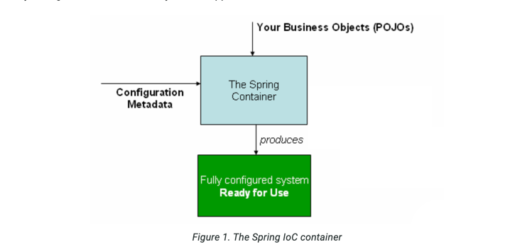

## 容器
容器通过读取configuration Metadata和使用springApplication相关接口 完成了bean的实例化，配置，和组装.



## 元数据配置
如上图所示configuration Metadata，元数据我认为包含业务bean配置、各种processor配置、配置类配置等（当然统称为bean也没问题）。
这个行为并不仅仅可以通过xml也可以是注解、java代码， spring ioc容器与其配置方式是完全解耦的.

spring ioc容器至少需要管理一个beanDefinition
基于xml
    方式的配置方式是通过<beans>和<bean>标签来配置beanDefinition
基于java配置
    通过@Configuration和@Bean（注解在方法上）来进行BeanDefinition的配置;
(通过判断方法是否包含注解来进行返回值获取以及向容器注入bean)

## 容器实例化
```text
ApplicationContext context = new ClassPathXmlApplicationContext("services.xml", "daos.xml");
```
我们可以通过构造器传入一个或者多个 configuration metadata的路径，
用来从文件系统，额外资源，classPath中加载配置元数据

## 构建基于xml的元数据配置
一般来说我们的单个配置代表着一个模块或者一块逻辑，那个将各个bean划分在不同的xml文件中可以让配置更加清晰
```xml
<beans>
	<import resource="services.xml"/>
	<import resource="resources/messageSource.xml"/>
	<import resource="/resources/themeSource.xml"/>

	<bean id="bean1" class="..."/>
	<bean id="bean2" class="..."/>
</beans>
```
被导入的xml是根据当前文件位置来进行判断的，所以这要求services.xml必须在当前文件夹下，另外两个文件必须在对应的路径下的文件夹下

## 使用容器
```text
// create and configure beans
ApplicationContext context = new ClassPathXmlApplicationContext("services.xml", "daos.xml");

// retrieve configured instance
PetStoreService service = context.getBean("petStore", PetStoreService.class);

// use configured instance
List<String> userList = service.getUsernameList();
```
groovy configuration使用略
https://docs.spring.io/spring-framework/reference/core/beans/basics.html